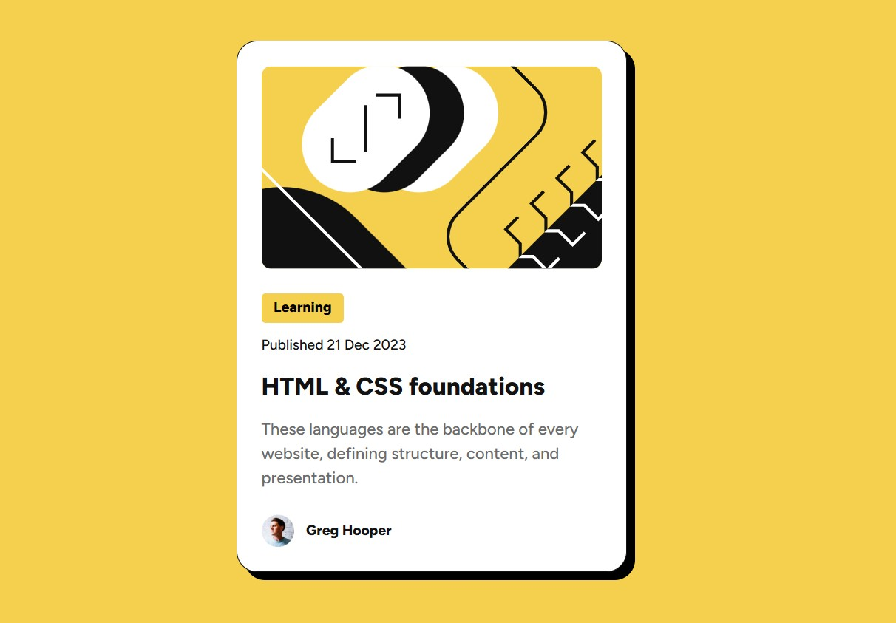

# Frontend Mentor - Blog preview card solution

This is a solution to the [Blog preview card challenge on Frontend Mentor](https://www.frontendmentor.io/challenges/blog-preview-card-ckPaj01IcS). Frontend Mentor challenges help you improve your coding skills by building realistic projects.

## Overview

### Screenshot

### Links

- [Solution URL](https://github.com/LynnLo30/blog-preview-card)
- [Live Site URL](https://lynnlo30.github.io/blog-preview-card/)

## My process

### Built with

- Semantic HTML5 markup
- CSS custom properties
- SCSS features like variables and nesting
- Flexbox
- Mobile-first workflow
- [CSS Reset](https://necolas.github.io/normalize.css/) - Based on Necolas's CSS Reset

### What I learned

- Use the `gap` CSS property to easily create consistent spacing between flex items.
- Load external font by @font-face
